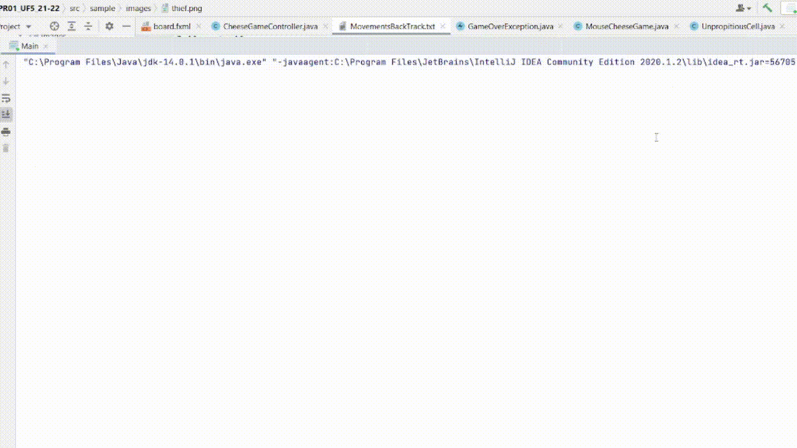

# 🧀 MouseCheeseGUI_BD_Full

**Simulación interactiva donde un ratón inteligente busca su queso en un laberinto. Con interfaz gráfica, seguimiento de movimientos y registro en base de datos.**

---

## 🎬 Demostración



---

## 🎮 Descripción

**MouseCheeseGUI_BD_Full** es una aplicación educativa desarrollada en Java que simula el comportamiento de un ratón en un tablero mientras busca el queso. A través de una interfaz gráfica intuitiva y una conexión a base de datos, el sistema permite visualizar y registrar los movimientos del ratón paso a paso.

## 🚀 Características principales

- 🧠 Simulación visual del ratón moviéndose por el tablero.
- 💾 Registro de movimientos en base de datos MySQL.
- 🖥️ Interfaz gráfica implementada con JavaFX.
- 🔎 Uso de una estructura stack i fichero para almacenar movimientos.
- 🧪 Código limpio y modular, ideal para proyectos académicos.


## ⚙️ Requisitos

- Java JDK 8 o superior
- Apache Maven
- MySQL (servidor y cliente)

## ▶️ Instalación y ejecución

1. **Clona este repositorio:**

   ```bash
   git clone https://github.com/GerardTV/MouseCheeseGUI_BD_Full.git
   cd MouseCheeseGUI_BD_Full

2. **Configurar la base de datos:**

- Crear una base de datos en MySQL.
- Ejecutar los scripts SQL ubicados en la carpeta sql/ para crear las tablas necesarias.
- Actualizar las credenciales de la base de datos en el archivo ConnexionDB.

3. **Compilar y ejecutar el proyecto**

## 📈 Ejemplo de Uso
- Al iniciar la aplicación, se mostrará el tablero con el ratón y el queso en posiciones aleatorias. 
- A medida que el ratón se mueve, sus pasos se registran y almacenan en la base de datos, permitiendo un análisis posterior de su comportamiento.
 - Puedes parar el juego en cualquier momento y al realizarlo, el ratón comenzará desde la última posición registrada.